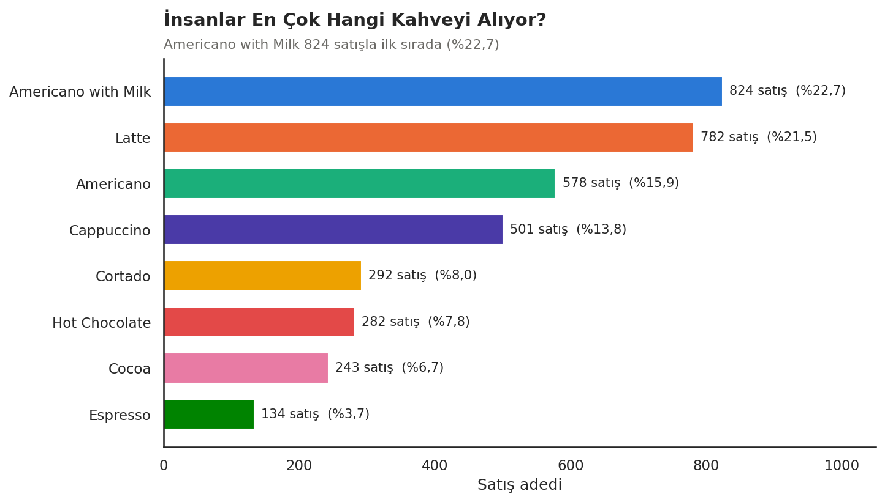
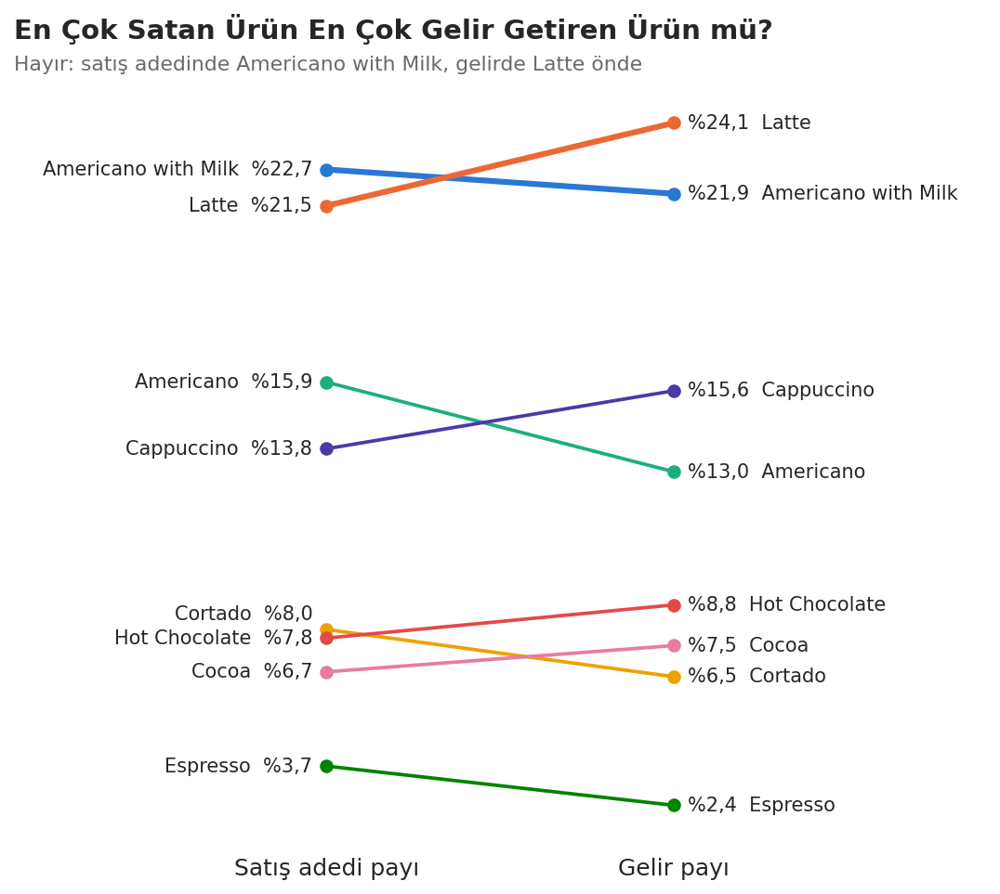
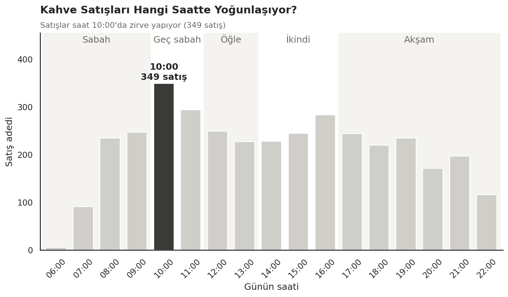
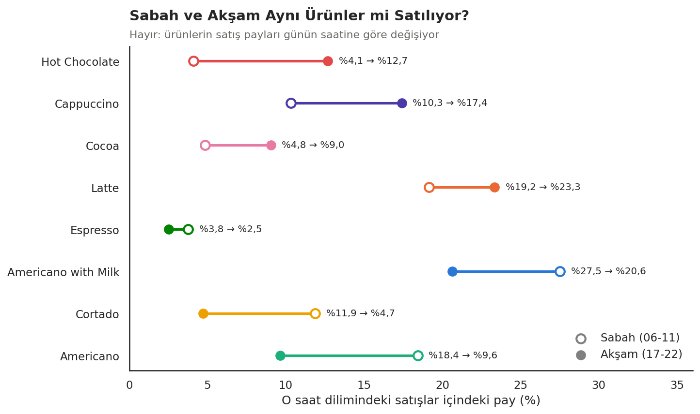
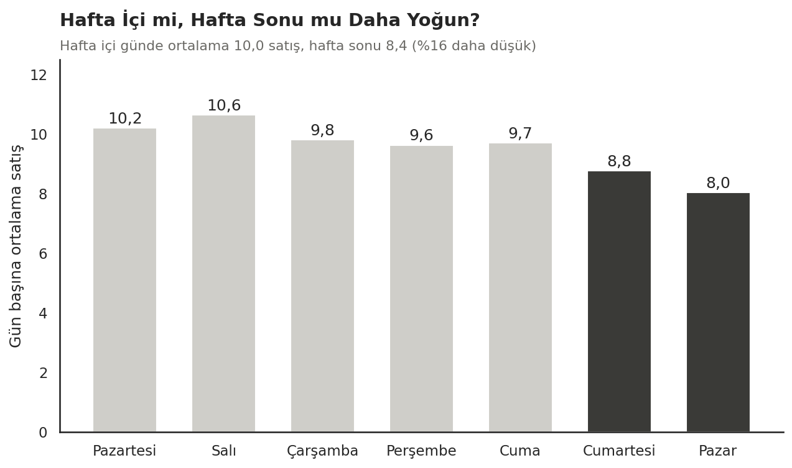
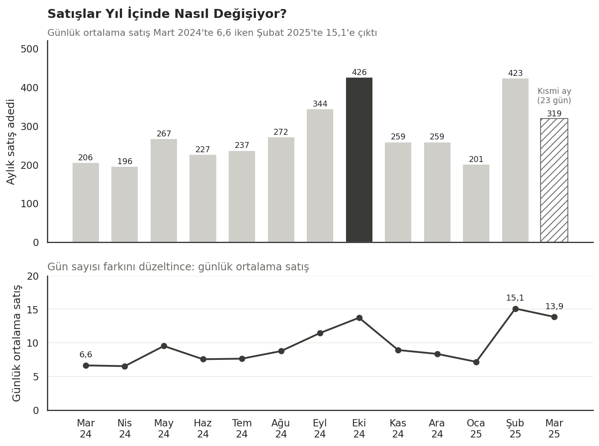
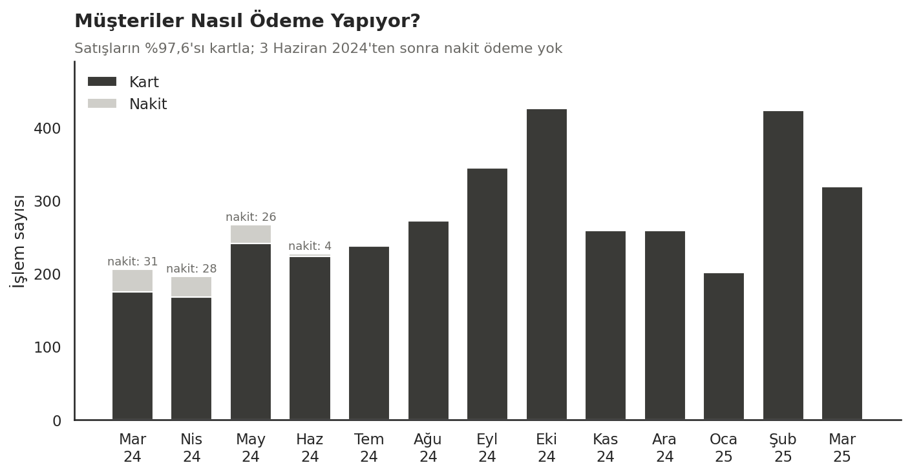

# Kahve Satış Analizi

3.636 satış kaydı, insanların ne zaman kahve aldığını, ne tercih ettiğini ve bu tercihlerin gün içinde nasıl değiştiğini anlatıyor. Bu projede bu kayıtlara basit sorular sordum ve cevapları doğrudan veriden çıkardım.

Bu veri setini seçmemin sebebi, herkesin günlük hayattan tanıdığı bir konu olması. "Sabah ne içiyoruz, akşam ne içiyoruz?" gibi sorular teknik bilgisi olmayan biri için de anlamlı. Benim için amaç gösterişli bir model kurmak değil; doğru soruları sorup sonuçları anlaşılır şekilde anlatabilmekti.

- **Veri:** [Coffee Sales – Kaggle](https://www.kaggle.com/datasets/ihelon/coffee-sales)
- **Dönem:** 1 Mart 2024 – 23 Mart 2025
- **Toplam satış:** 3.636

## Kısaca

| Toplam satış | En popüler ürün | En çok gelir getiren | En yoğun saat | En yoğun gün | En çok kullanılan ödeme |
|:---:|:---:|:---:|:---:|:---:|:---:|
| 3.636 | Americano with Milk | Latte | 10:00 | Salı | Kart (%97,6) |

## Öne Çıkan Bulgular

- **En popüler ürün Americano with Milk:** 824 satışla toplam satışların %22,7'si. Yaklaşık her 4-5 satıştan biri.
- **En çok satan ile en çok kazandıran farklı ürünler:** Americano with Milk satış adedinde önde, Latte ise gelirde ilk sırada.
- **En yoğun saat 10:00:** Bu saatte 349 satış yapılmış.
- **Tercihler gün içinde değişiyor:** Hot Chocolate'ın satış payı sabah %4,1 iken akşam %12,7'ye çıkıyor.
- **Hafta sonu daha sakin:** Hafta sonu günlük ortalama satışlar hafta içinden yaklaşık %16 düşük.
- **Satışlar yıl içinde arttı:** Günlük ortalama satış Mart 2024'te 6,6 iken Şubat 2025'te 15,1'e çıkmış.
- **Nakit neredeyse hiç kullanılmıyor:** Satışların %97,6'sı kartla. 3 Haziran 2024'ten sonra hiç nakit ödeme yok.

---

## Sorular ve Cevaplar

### 1. İnsanlar en çok hangi kahveyi alıyor?



Americano with Milk 824 satışla ilk sırada, Latte 782 satışla hemen arkasında. Bu iki ürün birlikte satışların %44'ünü oluşturuyor.

**İş açısından:** Bu iki üründe stok eksikliği yaşanması, satışların önemli bir kısmını etkileyebilir.

### 2. En çok satan kahve en çok gelir getiren kahve mi?



Hayır. Satış adedinde Americano with Milk önde, ama gelirde Latte ilk sırada: 27.866 ile toplam gelirin %24,1'i. Latte daha az satılıyor ama ortalama fiyatı daha yüksek (35,6'ya karşılık 30,7).

**İş açısından:** Sadece satış adedine bakmak, Latte ve Cappuccino gibi pahalı ürünlerin gelire katkısını gözden kaçırabilir.

### 3. Kahve satışları hangi saatte yoğunlaşıyor?



En yoğun saat 349 satışla 10:00. Saat başına bakınca en yoğun zaman dilimi 10:00-12:00 arası.

**İş açısından:** Stok kontrolü ve dolum 10:00'dan önce yapılırsa, en yoğun saatte ürün eksikliği yaşanma ihtimali azalabilir.

### 4. Sabah ve akşam aynı şeyler mi içiliyor?



Hayır, ürünlerin satış payları günün saatine göre değişiyor. Akşam saatlerinde Hot Chocolate'ın payı daha yüksek (sabah %4,1, akşam %12,7). Americano'da ise tersi var (sabah %18,4, akşam %9,6).

**İş açısından:** Malzeme kontrolü saate göre planlanabilir; örneğin akşamdan önce çikolata ve kakao malzemelerine bakılabilir.

Burada bir noktayı not etmek istiyorum: veri müşterilerin neden böyle tercih yaptığını göstermiyor. Sadece hangi saatte hangi ürünün satıldığını gösteriyor.

### 5. Hafta içi mi, hafta sonu mu daha yoğun?



Hafta içi günde ortalama 10,0, hafta sonu 8,4 satış yapılmış; hafta sonu yaklaşık %16 daha düşük. En yoğun gün Salı (10,6), en sakin gün Pazar (8,0). Her günden veride farklı sayıda olduğu için toplam yerine günlük ortalamayı kullandım.

**İş açısından:** Hafta sonu için küçük kampanyalar denenip etkileri ölçülebilir.

### 6. Satışlar yıl içinde nasıl değişiyor?



Günlük ortalama satış yıl içinde belirgin şekilde artmış: Mart 2024'te günde 6,6, Şubat 2025'te 15,1. Toplamda en yoğun ay Ekim 2024 (426), en sakin ay Nisan 2024 (196). Mart 2025 kısmi bir ay (23 gün), o yüzden grafikte ayrıca işaretledim.

**İş açısından:** Aylar farklı sayıda gün içerdiği için, karşılaştırma yaparken aylık toplam yerine günlük ortalamaya bakmak daha doğru sonuç verir.

### 7. Müşteriler nasıl ödeme yapıyor?



Satışların %97,6'sı kartla yapılmış. Nakit ödemeler sadece Mart-Haziran 2024 arasında görülüyor; 3 Haziran 2024'ten sonra hiç nakit ödeme yok.

**İş açısından:** Satışların neredeyse tamamı karta bağlı olduğu için kart ödeme sisteminin kesintisiz çalışması önemli.

---

## Bu Sonuçlar Ne Anlama Geliyor?

- Stok kontrolü en yoğun saat olan 10:00'dan önce yapılabilir.
- Sabah kahve, akşam çikolatalı içecek payı arttığı için ürün stoğu saate göre planlanabilir.
- Bakım ve temizlik gibi hazırlıklar yoğun saatlerden önce yapılabilir.
- Hafta sonu satışlarını artırmak için kampanyalar test edilebilir.
- Kart ödeme altyapısının sürekliliği satışlar için kritik.

*Bu öneriler veride görülen satış desenlerinden hareketle oluşturulmuştur; nedensellik iddiası taşımaz.*

## Kullandığım Araçlar

Python, Pandas, NumPy, Matplotlib, Seaborn, Jupyter Notebook

## Proje Yapısı

```text
kahve-satis-analizi/
├── README.md
├── coffee_sales_analysis.ipynb   # analizin tamamı
├── data/
│   └── coffee_sales.csv
├── images/                       # README'deki grafikler
├── requirements.txt
└── .gitignore
```

## Nasıl Çalıştırılır?

```bash
git clone https://github.com/sudenazkaymaz/kahve-satis-analizi.git
cd kahve-satis-analizi
pip install -r requirements.txt
jupyter notebook
```

Ardından `coffee_sales_analysis.ipynb` dosyasını açıp **Run All** ile çalıştırabilirsiniz.

## Veri Kaynağı

[Coffee Sales – Kaggle](https://www.kaggle.com/datasets/ihelon/coffee-sales). Veri setindeki `index_1.csv` dosyasını kullandım ve `data/coffee_sales.csv` adıyla kaydettim.

## Sınırlılıklar

- Veri setinin açıklamasına göre kayıtlar bir kahve otomatına ait. Konum, maliyet ve kâr bilgisi yok.
- Müşteri bilgisi (yaş, tercih nedeni vb.) yok. Sonuçlar "neden" sorusuna değil, "ne zaman ne satıldı" sorusuna cevap veriyor.
- Para birimi belirtilmemiş, fiyatlar dönem içinde değişmiş.
- Mart 2025 kısmi bir ay (23 gün).

## Hazırlayan

**Sudenaz Kaymaz**: Veri analizi, iş analizi ve yapay zekâ alanlarıyla ilgileniyorum. Bu projede amacım, veriden çıkan sonuçları teknik olmayan biri için de anlaşılır hâle getirmekti.


